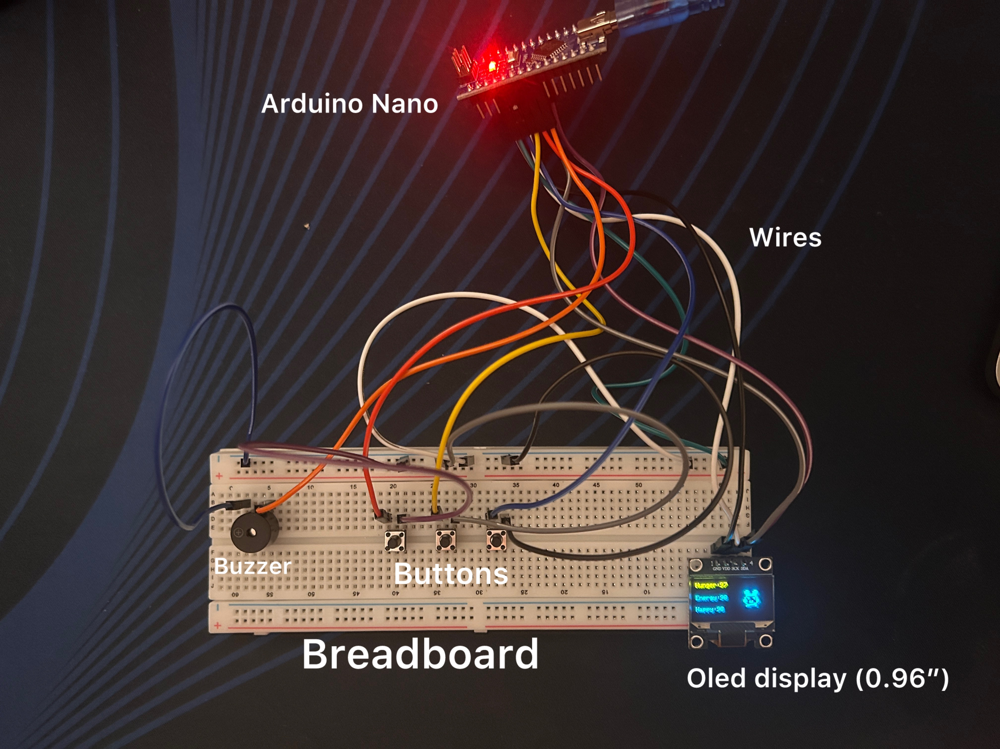
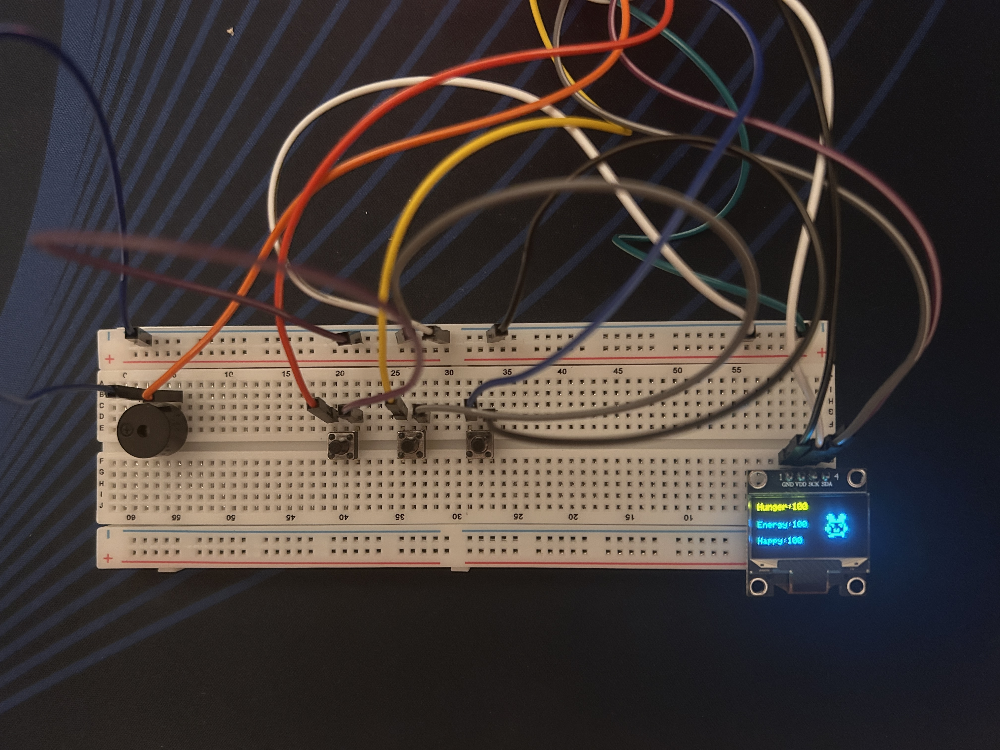
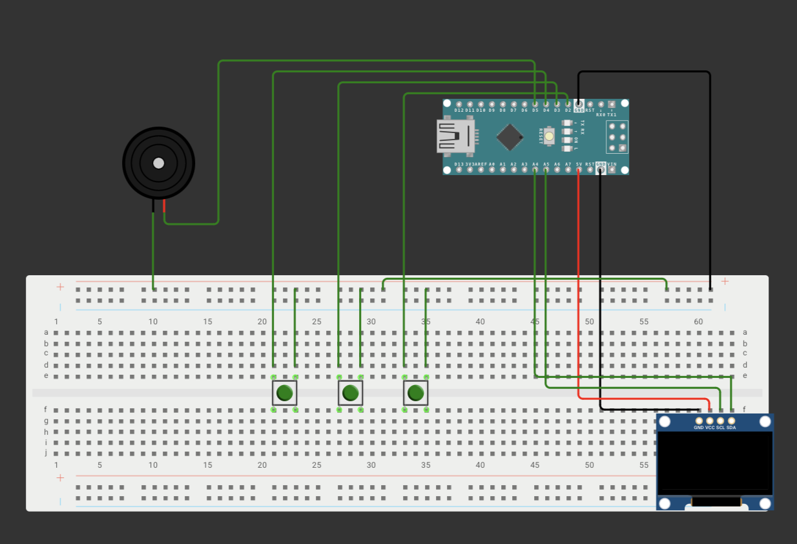
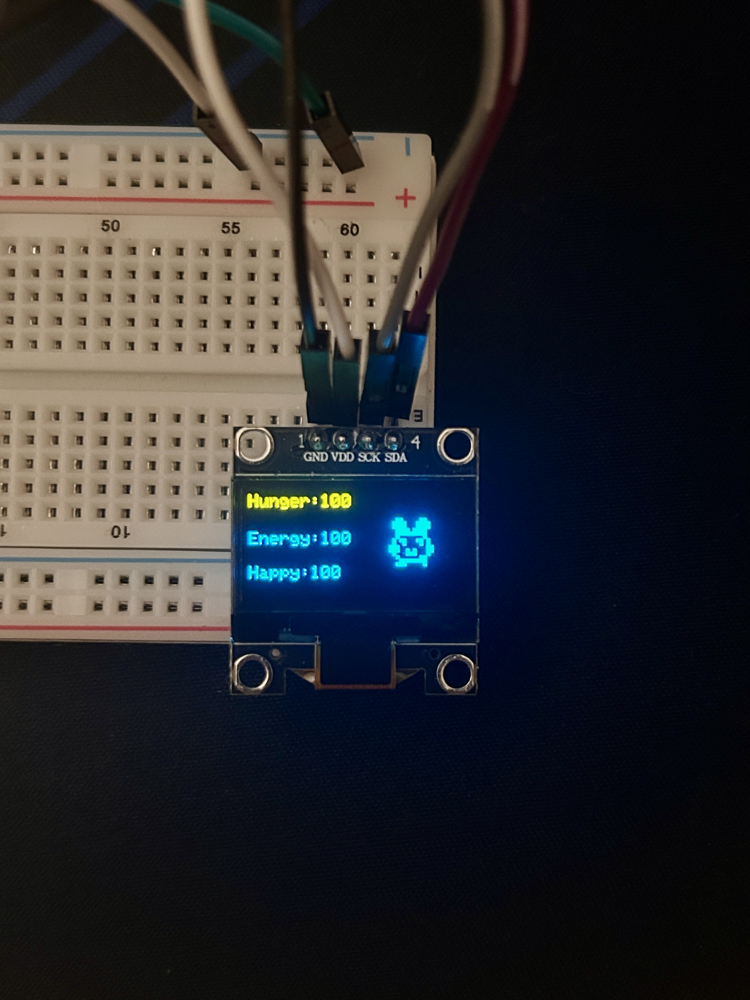
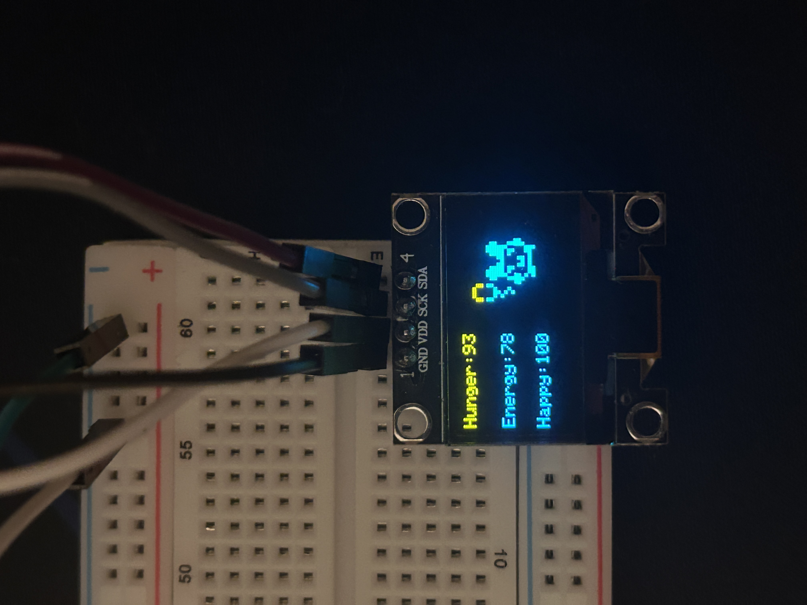
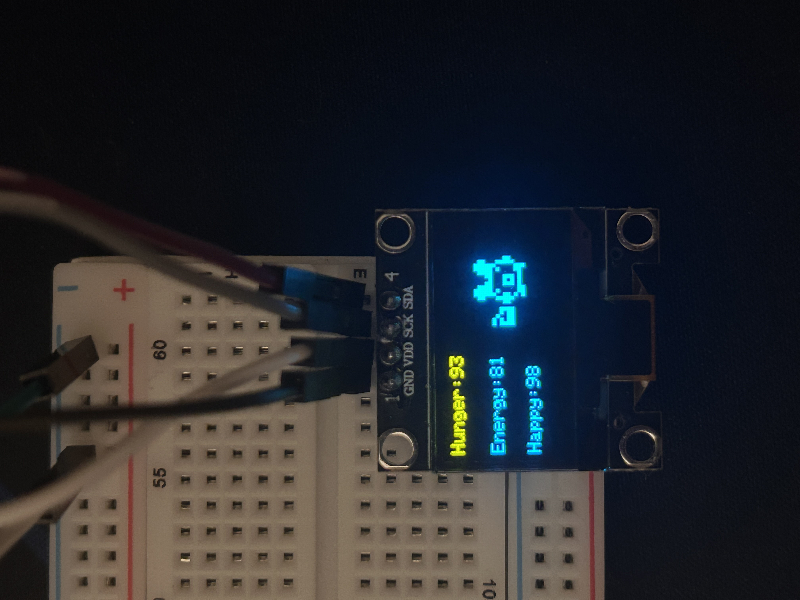
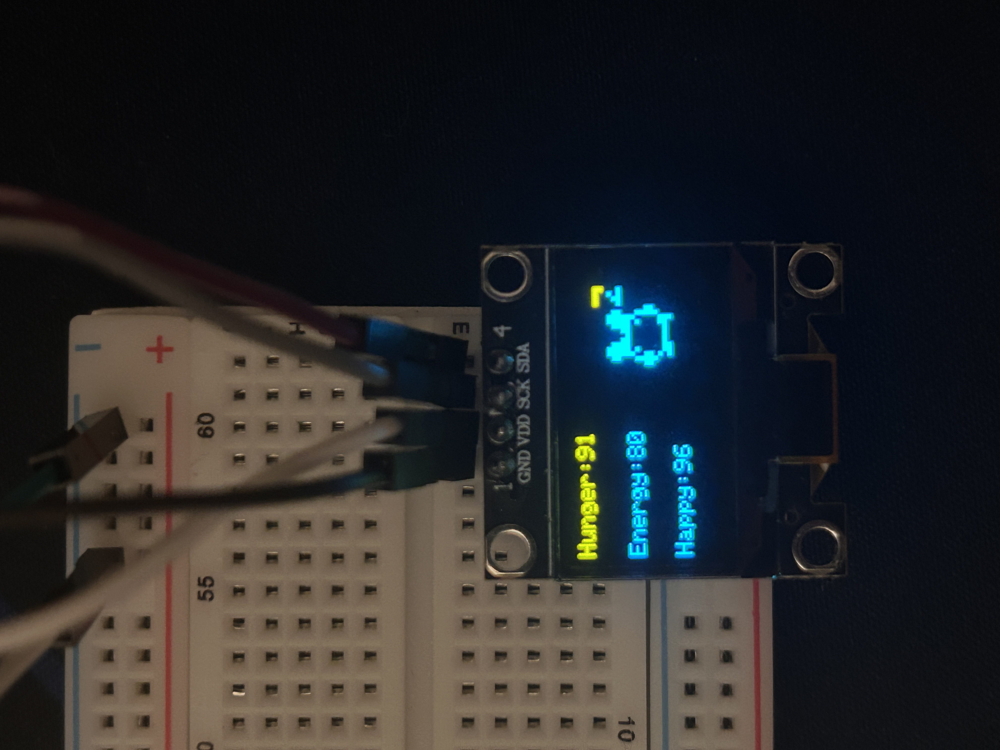

## DIY Tamagotchi
A fully functional Tamagotchi built from scratch on an Arduino Nano, with hand-drawn pixel-art animations and live stat tracking on an OLED display.

## Photos

## Demo

[Full demo video](Media/demo.mov)

## Features:
1. Feed, Play, and Sleep buttons, each fully debounced
2. Hunger, energy, and happiness stats with tradeoffs between actions
3. Hunger increase uses a diminishing-returns formula, scaling down as it approaches full
4. All three stats decay over time on their own, simulating a living creature
5. Energy regenerates while sleeping instead of decaying
6. 7 hand-drawn pixel-art expressions (happy, sleeping, playing, sad, tired, hungry, eating) that switch automatically based on stat thresholds and recent actions
7. Live stat display alongside the animated creature on a 128x64 OLED screen
8. Buzzer feedback on every button press

## Tech Stack:
- Microcontroller: Arduino Nano (ATmega328P)
- Display: 0.96" SSD1306 OLED, I2C
- Input: 3 tactile push buttons
- Output: Active buzzer
- Language: C++ (Arduino)
- Libraries: Adafruit_GFX, Adafruit_SSD1306, Wire

## How to Run:
1. Install the Arduino IDE
2. Install the Adafruit_GFX and Adafruit_SSD1306 libraries through the Library Manager
3. Wire the components following `wiring-diagram.png` — Feed (D2), Sleep (D3), Play (D4), Buzzer (D5), OLED SDA/SCL (A4/A5)
4. Open `tamagotchi.ino` in Arduino IDE
5. Select Arduino Nano as the board and the correct port
6. Upload the sketch

## Controls:
- Feed: increases hunger, small energy boost
- Play: increases happiness, costs energy
- Sleep: toggles sleep mode, energy regenerates while sleeping

## Why I Made This:
I built this to learn embedded systems and hardware programming, since most of my CS coursework had been software-only. It was a hands-on way to actually debug real hardware issues, including tracking down a split breadboard power rail and diagonally-wired push buttons along the way.
